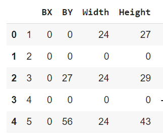
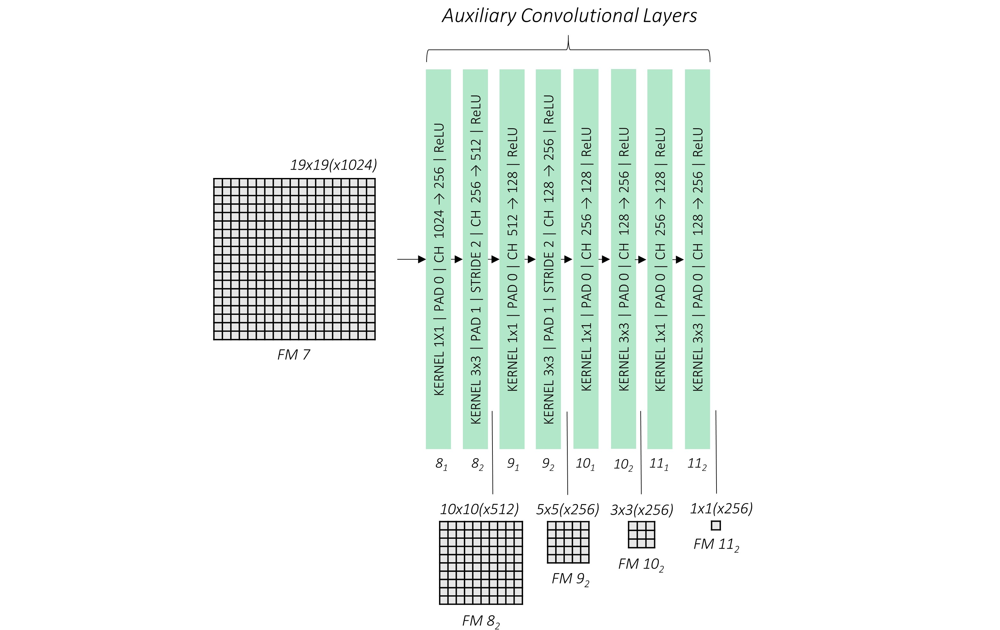

# Escherichia coli Bacteria Detection with Deep Learning(SSD Model) on Mother Machine

Figure1: A example of original image from ImageJ.

## Project Description 

To overcome the constraints of micro-colony experiments, microfluidic devices are specifically designed to spatially 
isolate and align single cells or lineages of cells. These devices contain geometrically fitting microstructures to 
restrict cells to spatially regular patterns. This geometrical restriction greatly facilitates the task of image analysis.
It is clear that segmentation accuracy directly affects cell tracking. It therefore makes sense to approach the design of 
the detection method from the point of view of drawing the bounding boxes inside dead-end channels: The microfluidic device
is simpler than the 2D micro-colonies, with key information already provided because the cells are restricted to grow in a
vertical channel. This type of structure can help to determine what methods of detection are truly useful compared to those
used to segment 2D micro-colonies. The successful detection allows later an accurate segmentation by U-Net at pixel level.
Single shot multi-box(SSD) detector is a very fast and high-accuracy object detection algorithm. SSD has no delegated region
proposal network and predicts the boundary boxes, and the classes directly from feature maps in one single pass. SSD reaches
an advanced detection level and satisfies our demands.

## Aims of the Project

This project aims to create a SSD-based framework. We will construct an adapted model based on the previous generated and
preprocessed datasets. Transformation of the bounding-box format ROI (Region of interest) into voc-dataset format is needed
in the first place. The modeling with the specific ratio of the bounding box will improve the accuracy. Fine-tuning the 
parameters is also the core work to finish this project. 

## Process of the Project
### 1. Data Preparation
Our data set consists of 6 stacked microscope images in total, and they are in 6 different
resolutions. With these data we have also csv files that has created ImageJ program. These 6 image's resolutions are as follows : 
(width,height,channel) data type
* (8580,256,2) 16 bit
* (11670,323,2) 16 bit
* (11370,286,2) 16 bit
* (11400,276,2) 16 bit
* (11400,283,2) 16 bit
* (11460,285,2) 16 bit
  
( You can see an example above. )

*What does the csv files contain?*

* BX: bounding box(bbox) x_1 location
* BY: bbox y_1 location
* Width : bbox width
* Height : bbox height

Figure2: A part of csv file

As seen above, besides different and huge resolutions, our images consist of 16 bit image data type and 2 channels. 
In order to adapt our existing images to the ssd300 architecture,
(You can see this process into the [utils](https://github.com/yemre-data/ecoli_bacteria_detection/blob/main/utils.py). )
1. Converted them into the RGB channel and 8 bit.
2. Unstacked them one by one we got 108 images.(6*18)
3. Cropped them to get a size of 300 by 300 and filled the missing part in the height with rgb(0,0,0)-black.
4. While cropping image, we save the bbox information in to the json file with label and difficulty attributes. 
   If the part of image does not have bbox, we 
   passed them.
5. Finally, we randomly split data as TRAIN and TEST and saving json files.

As a result, we have obtained 1752 training images and 195 test images.

   

Figure3: An example image data with bboxes.

### 2. Data transforming and load to tensor
1. First we loaded our float,long, and, byte data in to the tensor,
2. Then we performed several augmentation method which are expanding, cropping, flipping, photometric distort,
3. We normalize data with ImageNet data mean and standard deviation because we are using transfer learning weights to base conv.
   (mean = [0.485, 0.456, 0.406], std = [0.229, 0.224, 0.225])
   
I would explain here how we normalize data with mean and std. In utils.py we are using torch transform functional Normalize function 
to normalize images. Where mean and std are the mean and standard deviation of the RGB pixels and this is common to the 
ImageNet dataset.To do this first the channel mean is subtracted from each input channel and then the result is divided 
by the channel standard deviation. After this process, standard deviation of the image become 0.0 and 1.0 respectively.
Transformations are really important to success in the SSD model. It affects to learning process and computing time.

### 3. Modelling and model explanation
I will explain modeling in 2 parts. I will explain the concept of the model and what they aim with this study 
they published, and then I will explain what processes are in the implementation, respectively.

### 3.1 Model explanation

Figure4: Structure of architecture

SSD is simple relative to methods that require object
proposals because it completely eliminates proposal generation and subsequent
pixel or feature resampling stages and encapsulates all computation in a single
network. The SSD approach is based on a feed-forward convolutional network that produces
a fixed-size collection of bounding boxes and scores for the presence of object class
instances in those boxes, followed by a non-maximum suppression step to produce the
final detections. With this capsule method, we perform localization and class prediction tasks at the same time, thus we saving 
time in computing.
As seen in the figure4, the architecture consists of four main parts. Firstly, <strong>7 feature maps</strong> are creating by passing the 
data from adopted VGG16 base layers. (Adopted VGG16: we delete last fully connected and we convert fc6 and fc7 to 
convolutional layer as conv6 and conv7.) Second we re-do conv on the last base of conv layer thus, we created totally 11 feature maps.
Then we are using 6 feature maps those are 'conv4_3','conv7','conv8_2','conv9_2','conv10_2,'conv11_2 to predict 8732 
priors(anchors) per class with location and class.Finally, we put 8732 priors to the Non-Maximum Suppression function 
to eliminate priors then we reach final bounding box. 

### 3.2 Modeling(implementation)
We have 5 different classes to build model and train. Those are ; base conv, auxiliary conv, prediction conv, ssd300,
and multi box loss.
### 3.2.1 Base(VGG16) convolutional
As stated above, we use a fully convolutional structure to create base feature maps in this class. At the same time, we
bring the model to a more learnable level by getting help from the transfer learning magic.Therefore, we need to adjust 
the weights of the VGG16 model we have received, because we do not have a fully connected layer. In utils.py decimate 
function is doing down sampling for conv6 and conv7. With this way we create 15 conv layer and 5 pooling layer with
ImageNet weights. Input dimension is (N, 3, 300, 300) and output are 5 feature maps and last layer dimension is (N, 1024, 19, 19).
However, we will use just two feature maps from base part which are conv4_3, conv7 as stated in the paper.
### 3.2.2 Auxiliary convolutional

Figure5: Auxiliary conv

As seen in figure 5 above, we find 4 feature maps by passing 8 more layers to the last layer of VGG16 base. With this,
we can capture even very small features of the image. Last dimension is  # (N, 256, 1, 1). N : batch_size

### 3.2.3 Prediction Conv 
Before explain prediction processes, I would clarify one of definition that is really crucial to understand concept.
Priors: Priors are the fixed scale and ratio boxes to the feature maps that we have determined beforehand. While we are 
building our prediction model, we add it to our model as a function (SSD300). We can change the ratios and scales that 
we define in this function for different tasks.

In this class, we need to predict two values, which are the object's class and its localization. Using the 6 feature maps
we obtained before(base conv and extra conv), we predict 8732 boxes (that will compute with priors in the loss) and also
predict the class of each box. So how do we do this?
I would like to explain one map as an example here. Let's take conv_4_3_feats for example. We prepared this map as output
channel (N,512,38,38) in base conv . Here again, we need to create an appropriate input convolutional for this out. 
At the same time, we define the output of our layer according to the amount of estimation of the number of boxes for each
position we predetermined. conv_4_3_feats has 4 priors for each position. On the other hand, since our boxes have 4 positions, we
expect our layer conv_4_3_feats to output 16 sizes (N, 16, 38, 38).Then we replace the tensors with the permute 
function and send them to the chunk of memory with contiguous function (N, 38, 38, 16). Finally, we get the tensor (N, 5776, 4) 
by reshaping the tensor with the view function. That's just a prediction of 5776 of conv_4_3_feats. Now you may have a 
question, why do we predict 8732 of prior's 5776 from a map? Because the map is the biggest and has more information, it will 
increase our accuracy by making the more prior estimation here.
So we are doing same steps to other maps and finally we concatenate all 6 tensors, and we predict 8732 priors. After 
that, we predict class scores for each predicted priors(if you have one class as we have you will have two class total 
your object and background)(N, 5776, n_classes).
### 3.2.4 SSD300
Here, the final model is created by combining the conv classes described above.

### 3.2.5 Multi-box Loss 
One of the crucial things is to calculate the loss for journey of teaching our model. In this model, since we predict the
location and class of the objects, two losses will emerge. By aggregating these losses, we calculate the final loss.

**Loc Loss**
1. First finding overlaps(Jaccard func.) between 8732 priors and N ground truth.(8732,N)
2. Matching each prior to object which it has the greatest overlap.
3. Finding positive matches and negative matches by check overlaps are greater than 0.5 or less than 0.5.
4. Identifying non-background objects with positive matches.
5. Encoding(g_c_x, g_c_y, g_w, g_h) positive matches with pre-defined priors because we predict is same encoded form.
6. Putting these predicted value and encoded ground truth value in smooth_l1 function.

**Confidence Loss (class loss)**
We use cross entropy loss to find class loss we calculate with predicted class scores and true class values.
Authors are using an approach to called Hard Negative Mining. If the negative matches overwhelm the positive ones, 
we will end up with a model that is less likely to detect objects because, more often than not, it is taught to detect 
the background class. Therefore, we are using hard negative priors where are they have been max loss. Then as paper stated,
we calculate average loss positive and hard negative over the just positive losses.

Final loss will be shown below.
L = L(confidence) + alpha*L(localization)

alpha:Normally we do not need alpha parameter . It is future learnable parameter but authors has to taken as 1 we are 
using same value for it.

### 4. Training and several experiments

## License
[MIT](https://choosealicense.com/licenses/mit/)